Compare SV genotypes with public SV catalogs
================

``` r
library(dplyr)
library(sveval)
library(GenomicRanges)
library(ggplot2)
library(gridExtra)
library(knitr)
winsor <- function(x, u){
  if(any(x>u)) x[x>u] = u
  x
}
## list of graphs
ggp = list()
```

## Simple repeat annotation

Can be used to rescue misplaced SVs within simple repeats.

``` r
if(!file.exists('simpleRepeat.hg38.txt.gz')){
  download.file('https://hgdownload.soe.ucsc.edu/goldenPath/hg38/database/simpleRepeat.txt.gz', 'simpleRepeat.hg38.txt.gz')
}
sr = read.table('simpleRepeat.hg38.txt.gz', as.is=TRUE)
sr = reduce(GRanges(sr$V2, IRanges(sr$V3, sr$V4)))
```

## Public SV catalogs

Prepared by `prepare-public-catalogs.R`

``` r
load('public-sv-catalogs.RData', verbose=TRUE)
```

    ## Loading objects:
    ##   kgp3
    ##   gnomad
    ##   svpop

### SV catalog from the 1000 Genomes Project phase 3

``` r
## samples
max(kgp3$ncalls)
```

    ## [1] 2504

``` r
## SVs
length(kgp3)
```

    ## [1] 62860

``` r
## per type
table(kgp3$type)
```

    ## 
    ##   DEL   INS   INV 
    ## 44986 17088   786

### gnomAD-SV catalog

``` r
## SVs
length(gnomad)
```

    ## [1] 342702

``` r
## per type
table(gnomad$type)
```

    ## 
    ##    CPX    DEL    INS    INV 
    ##   5106 173830 163130    636

### SVPOP

``` r
## samples
max(svpop$ncalls)
```

    ## [1] 440

``` r
## SVs
length(svpop)
```

    ## [1] 91991

``` r
## per type
table(svpop$type)
```

    ## 
    ##   DEL   INS 
    ## 38542 53449

## SVs genotyped using vg

### SVs genotyped in MESA

``` r
## SVs grouped by site ('svsite' and 'clique' columns)
mesa = read.table('svs.mesa2k.svsite80al.tsv.gz', as.is=TRUE, header=TRUE)

## stats for each SV locus
## use the most frequent allele (and then the largest) for ac/af/size
## also saves sum/max/min across all alleles
mesa.s = mesa %>% arrange(desc(af), desc(size)) %>%
  group_by(seqnames, svsite, type, clique) %>%
  summarize(start=start[1], end=end[1], ac=ac[1], af=af[1], size=size[1], .groups='drop') %>%
  filter(size>=50) %>% makeGRangesFromDataFrame(keep.extra.columns=TRUE)
```

### SVs genotyped in 2,504 samples from 1000 Genomes Project

``` r
## SVs grouped by site ('svsite' and 'clique' columns)
kgp = read.table('svs.2504kgp.svsite80al.tsv.gz', as.is=TRUE, header=TRUE)

## stats for each SV locus
## use the most frequent allele (and then the largest) for ac/af/size
## also saves sum/max/min across all alleles
kgp.s = kgp %>% arrange(desc(af), desc(size)) %>%
  group_by(seqnames, svsite, type, clique) %>%
  summarize(start=start[1], end=end[1], ac=ac[1], af=af[1], size=size[1], .groups='drop') %>%
  filter(size>=50) %>% makeGRangesFromDataFrame(keep.extra.columns=TRUE)
```

## Frequency distributions

Variants with at least 1% frequency.

``` r
af.df = rbind(
  tibble(af=kgp3$af, cat='1000GP phase 3'),
  tibble(af=gnomad$af, cat='gnomAD-SV'),
  tibble(af=svpop$af, cat='SVPOP'),
  tibble(af=mesa$af, cat='vg-MESA'),
  tibble(af=kgp$af, cat='vg-1000GP'))

ggp$afdist = ggplot(af.df, aes(x=af)) + geom_histogram() +
  ylab('structural variant') + xlab('allele frequency') +
  theme_bw() +
  facet_grid(cat~., scales='free') + 
  xlim(.01,1)
ggp$afdist
```

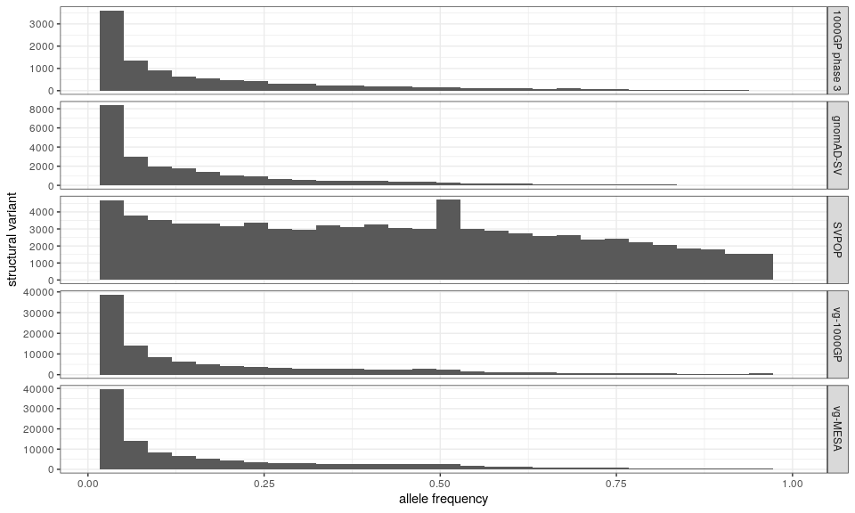<!-- -->

## Comparison with the 1000 Genomes Project phase 3 catalog

``` r
olcatstats = function(sites.gr, cat.gr, min.ol=.1, max.ins.dist=200, use.sr=FALSE){
  if(!use.sr){
    sr = NULL
  }
  sites.gr$ac = 1
  cat.gr$ac = 1
  ol.gr = suppressWarnings(svOverlap(sites.gr, cat.gr, min.ol=min.ol, max.ins.dist=max.ins.dist, simprep=sr))
  ## compute proportions
  tibble(prop.vgsite=length(unique(ol.gr$queryHits)) / length(sites.gr),
         prop.cat=length(unique(ol.gr$subjectHits)) / length(cat.gr))
}

rbind(
  olcatstats(mesa.s, kgp3) %>% mutate(set='vg-MESA vs 1000GP'),
  olcatstats(subset(mesa.s, af>=.05), subset(kgp3, af>=.05)) %>% mutate(set='vg-MESA freq>=5% vs 1000GP freq>=5%'),
  olcatstats(kgp.s, kgp3) %>% mutate(set='vg-1000GP vs 1000GP'),
  olcatstats(subset(kgp.s, af>=.05), subset(kgp3, af>=.05)) %>% mutate(set='vg-1000GP freq>=5% vs 1000GP freq>=5%')
) %>% select(set, prop.vgsite, prop.cat) %>% kable(digits=3)
```

| set                                     | prop.vgsite | prop.cat |
| :-------------------------------------- | ----------: | -------: |
| vg-MESA vs 1000GP                       |       0.068 |    0.165 |
| vg-MESA freq\>=5% vs 1000GP freq\>=5%   |       0.087 |    0.792 |
| vg-1000GP vs 1000GP                     |       0.068 |    0.166 |
| vg-1000GP freq\>=5% vs 1000GP freq\>=5% |       0.090 |    0.819 |

``` r
ol.gr = suppressWarnings(svOverlap(mesa.s, kgp3, min.ol=.1, max.ins.dist=200))
freq.mesa.kgp3.df = ol.gr %>% as.data.frame %>%
  mutate(af=mesa.s$af[queryHits], cat.af=kgp3$af[subjectHits])

ggplot(freq.mesa.kgp3.df, aes(x=af, y=cat.af)) +
  geom_point(alpha=.3) +
  xlab('allele frequency in vg-MESA') + ylab('allele frequency in 1000GP phase 3') + 
  theme_bw()
```

<!-- -->

``` r
ggp$mesa_kgp3 = ggplot(freq.mesa.kgp3.df, aes(x=af-cat.af)) +
  geom_histogram() +
  xlab('frequency difference (vg-MESA - 1000GP phase 3)') +
  ylab('structural variant') + 
  theme_bw()
ggp$mesa_kgp3
```

<!-- -->

``` r
ol.gr = suppressWarnings(svOverlap(kgp.s, kgp3, min.ol=.1, max.ins.dist=200))
freq.kgp.kgp3.df = ol.gr %>% as.data.frame %>%
  mutate(af=kgp.s$af[queryHits], cat.af=kgp3$af[subjectHits])

ggplot(freq.kgp.kgp3.df, aes(x=af, y=cat.af)) +
  geom_point(alpha=.3) +
  xlab('allele frequency in vg-1000GP') + ylab('allele frequency in 1000GP phase 3') + 
  theme_bw()
```

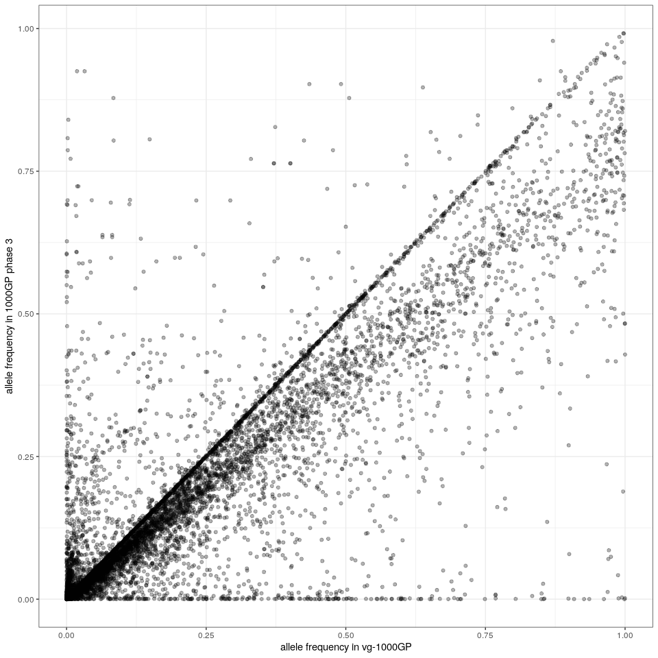<!-- -->

``` r
ggplot(freq.kgp.kgp3.df, aes(x=af-cat.af)) +
  geom_histogram() +
  xlab('frequency difference (vg-1000GP - 1000GP phase 3)') +
  ylab('structural variant') + 
  theme_bw()
```

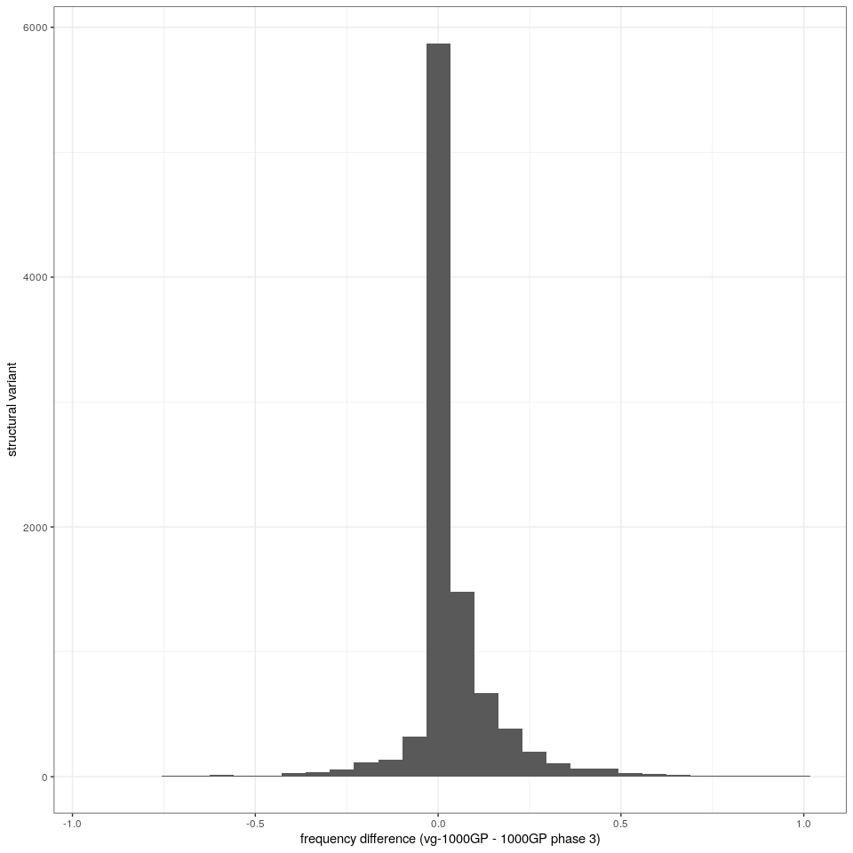<!-- -->

## Comparison with the gnomAD-SV catalog

``` r
rbind(
  olcatstats(mesa.s, gnomad) %>% mutate(set='vg-MESA vs gnomAD-SV'),
  olcatstats(subset(mesa.s, af>=.05), subset(gnomad, af>=.05)) %>% mutate(set='vg-MESA freq>=5% vs gnomAD-SV freq>=5%'),
  olcatstats(kgp.s, gnomad) %>% mutate(set='vg-1000GP vs gnomAD-SV'),
  olcatstats(subset(kgp.s, af>=.05), subset(gnomad, af>=.05)) %>% mutate(set='vg-1000GP freq>=5% vs gnomAD-SV freq>=5%')
) %>% select(set, prop.vgsite, prop.cat) %>% kable(digits=3)
```

| set                                        | prop.vgsite | prop.cat |
| :----------------------------------------- | ----------: | -------: |
| vg-MESA vs gnomAD-SV                       |       0.283 |    0.092 |
| vg-MESA freq\>=5% vs gnomAD-SV freq\>=5%   |       0.151 |    0.588 |
| vg-1000GP vs gnomAD-SV                     |       0.284 |    0.091 |
| vg-1000GP freq\>=5% vs gnomAD-SV freq\>=5% |       0.154 |    0.599 |

``` r
ol.gr = suppressWarnings(svOverlap(mesa.s, gnomad, min.ol=.1, max.ins.dist=200))
freq.mesa.gnomad.df = ol.gr %>% as.data.frame %>%
  mutate(af=mesa.s$af[queryHits], cat.af=gnomad$af[subjectHits])

ggplot(freq.mesa.gnomad.df, aes(x=af, y=cat.af)) +
  geom_point(alpha=.3) +
  xlab('allele frequency in vg-MESA') + ylab('allele frequency in gnomAD-SV') + 
  theme_bw()
```

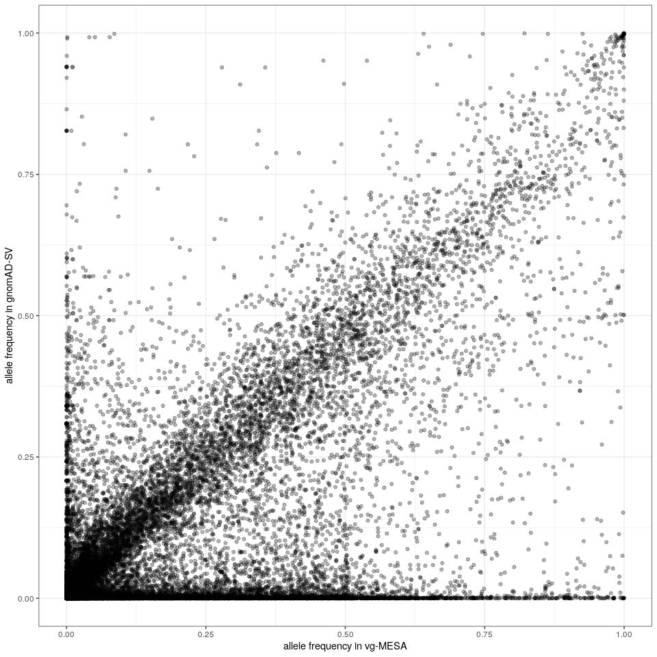<!-- -->

``` r
ggp$mesa_gnomad = ggplot(freq.mesa.gnomad.df, aes(x=af-cat.af)) +
  geom_histogram() +
  xlab('frequency difference (vg-MESA - gnomAD-SV)') +
  ylab('structural variant') + 
  theme_bw()
ggp$mesa_gnomad
```

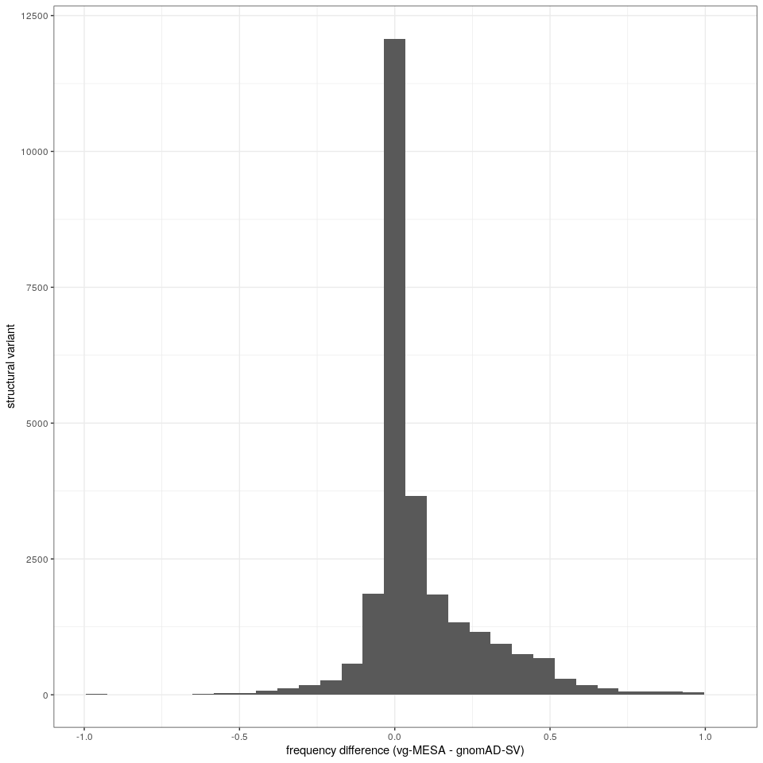<!-- -->

``` r
ol.gr = suppressWarnings(svOverlap(kgp.s, gnomad, min.ol=.1, max.ins.dist=200))
freq.kgp.gnomad.df = ol.gr %>% as.data.frame %>%
  mutate(af=kgp.s$af[queryHits], cat.af=gnomad$af[subjectHits])

ggplot(freq.kgp.gnomad.df, aes(x=af, y=cat.af)) +
  geom_point(alpha=.3) +
  xlab('allele frequency in vg-1000GP') + ylab('allele frequency in gnomAD-SV') + 
  theme_bw()
```

<!-- -->

``` r
ggplot(freq.kgp.gnomad.df, aes(x=af-cat.af)) +
  geom_histogram() +
  xlab('frequency difference (vg-1000GP - gnomAD-SV)') +
  ylab('structural variant') + 
  theme_bw()
```

<!-- -->

## Comparison with SVPOP

``` r
rbind(
  olcatstats(mesa.s, svpop) %>% mutate(set='vg-MESA vs SVPOP'),
  olcatstats(kgp.s, svpop) %>% mutate(set='vg-1000GP vs SVPOP')
) %>% select(set, prop.vgsite, prop.cat) %>% kable(digits=3)
```

| set                | prop.vgsite | prop.cat |
| :----------------- | ----------: | -------: |
| vg-MESA vs SVPOP   |       0.860 |    0.945 |
| vg-1000GP vs SVPOP |       0.859 |    0.933 |

``` r
ol.gr = suppressWarnings(svOverlap(mesa.s, svpop, min.ol=.1, max.ins.dist=200))
freq.mesa.svpop.df = ol.gr %>% as.data.frame %>%
  mutate(af=mesa.s$af[queryHits], cat.af=svpop$af[subjectHits])

ggplot(freq.mesa.svpop.df, aes(x=af, y=cat.af)) +
  geom_point(alpha=.3) +
  xlab('allele frequency in vg-MESA') + ylab('allele frequency in SVPOP') + 
  theme_bw()
```

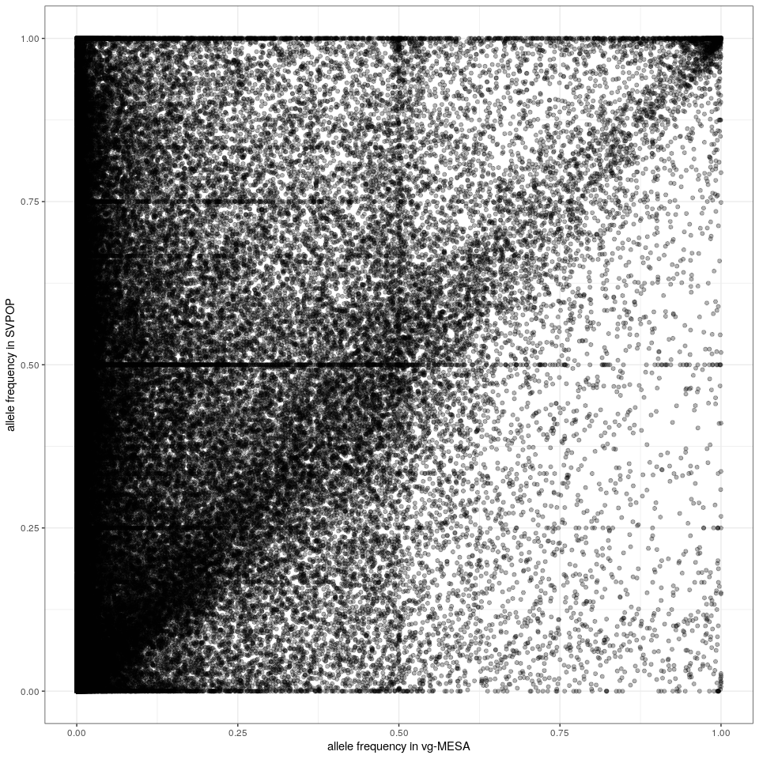<!-- -->

``` r
ggp$mesa_svpop = ggplot(freq.mesa.svpop.df, aes(x=af-cat.af)) +
  geom_histogram() +
  xlab('frequency difference (vg-MESA - SVPOP)') +
  ylab('structural variant') + 
  theme_bw()
ggp$mesa_svpop
```

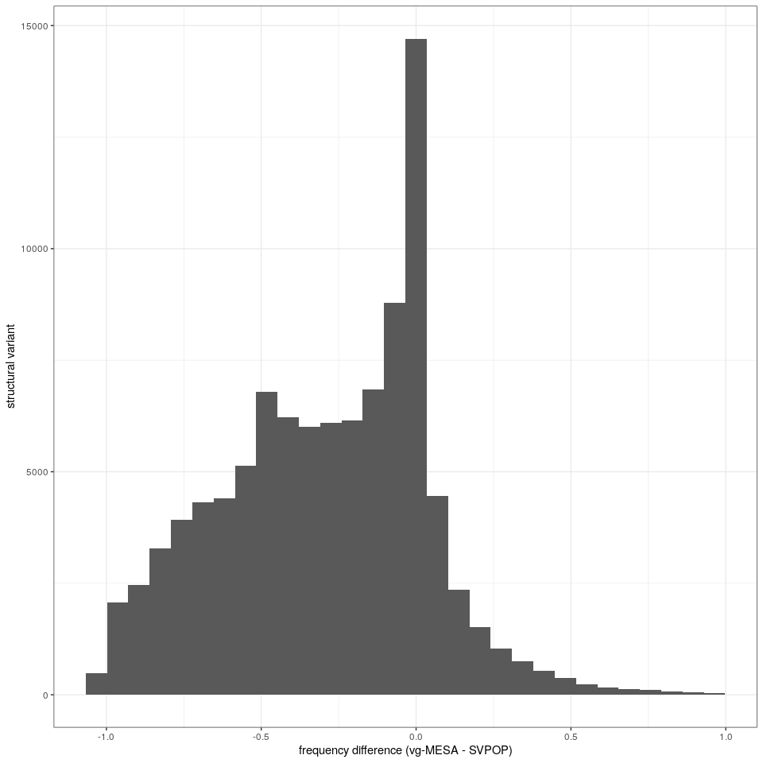<!-- -->

``` r
ol.gr = suppressWarnings(svOverlap(kgp.s, svpop, min.ol=.1, max.ins.dist=200))
freq.kgp.svpop.df = ol.gr %>% as.data.frame %>%
  mutate(af=kgp.s$af[queryHits], cat.af=svpop$af[subjectHits])

freq.kgp.svpop.df %>% filter(af>.05, cat.af>.05) %>% 
  ggplot(aes(x=af, y=cat.af)) +
  geom_point(alpha=.5) +
  xlab('allele frequency in vg-1000GP') + ylab('allele frequency in SVPOP') + 
  ## geom_bin2d() +
  theme_bw()
```

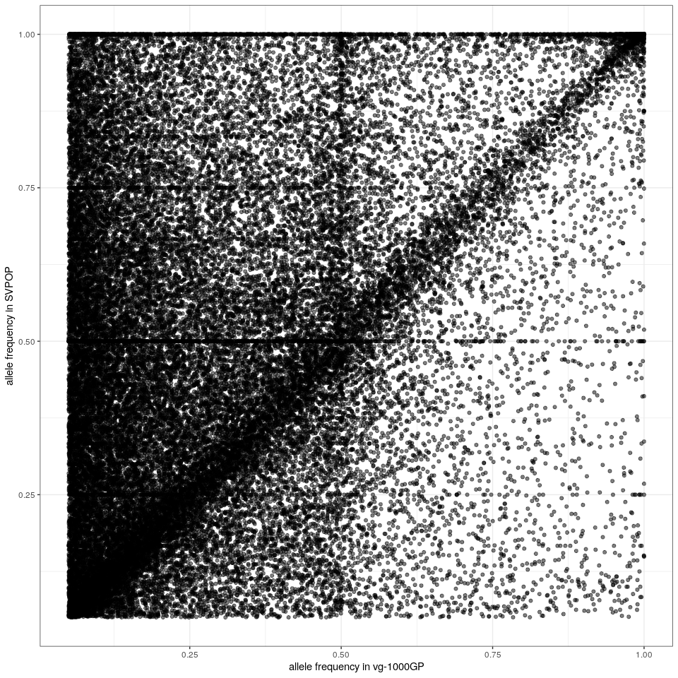<!-- -->

``` r
ggplot(freq.kgp.svpop.df, aes(x=af-cat.af)) +
  geom_histogram() +
  xlab('frequency difference (vg-1000GP - SVPOP)') +
  ylab('structural variant') + 
  theme_bw()
```

<!-- -->

### SVPOP vs gnomAD-SV/1000GP

``` r
ol.gr = suppressWarnings(svOverlap(svpop, kgp3, min.ol=.1, max.ins.dist=200))
freq.svpop.kgp3.df = ol.gr %>% as.data.frame %>%
  mutate(af=svpop$af[queryHits], cat.af=kgp3$af[subjectHits])

ggplot(freq.svpop.kgp3.df, aes(x=af, y=cat.af)) +
  geom_point(alpha=.3) +
  xlab('allele frequency in SVPOP') + ylab('allele frequency in 1000GP phase 3') +
  theme_bw()
```

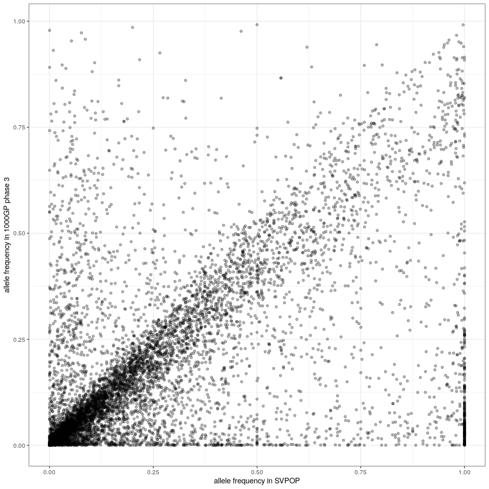<!-- -->

``` r
ggp$svpop_kgp3 = ggplot(freq.svpop.kgp3.df, aes(x=af-cat.af)) +
  geom_histogram() +
  xlab('frequency difference (SVPOP - 1000GP phase 3)') +
  ylab('structural variant') + 
  theme_bw()
ggp$svpop_kgp3
```

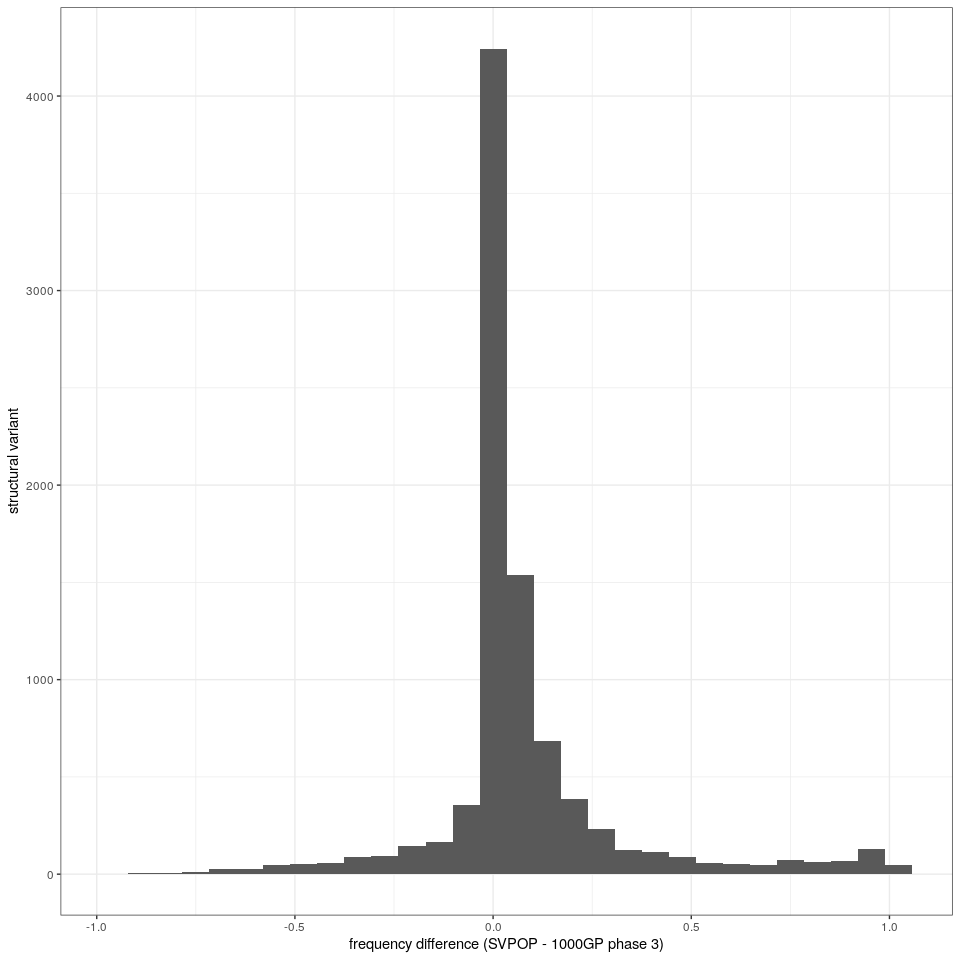<!-- -->

``` r
ol.gr = suppressWarnings(svOverlap(svpop, gnomad, min.ol=.1, max.ins.dist=200))
freq.svpop.gnomad.df = ol.gr %>% as.data.frame %>%
  mutate(af=svpop$af[queryHits], cat.af=gnomad$af[subjectHits])

ggplot(freq.svpop.gnomad.df, aes(x=af, y=cat.af)) +
  geom_point(alpha=.3) +
  xlab('allele frequency in SVPOP') + ylab('allele frequency in gnomAD-SV') +
  theme_bw()
```

<!-- -->

``` r
ggp$svpop_gnomad = ggplot(freq.svpop.gnomad.df, aes(x=af-cat.af)) +
  geom_histogram() +
  xlab('frequency difference (SVPOP - gnomAD-SV)') +
  ylab('structural variant') + 
  theme_bw()
ggp$svpop_gnomad
```

<!-- -->

## Overlap with simple repeats, satellites or low-complexity regions

``` r
## simple repeats
if(!file.exists('simpleRepeat.hg38.txt.gz')){
  download.file('https://hgdownload.soe.ucsc.edu/goldenPath/hg38/database/simpleRepeat.txt.gz', 'simpleRepeat.hg38.txt.gz')
}
sr = read.table('simpleRepeat.hg38.txt.gz', as.is=TRUE)
sr = reduce(GRanges(sr$V2, IRanges(sr$V3, sr$V4)))
sr$repClass = 'Simple_repeat'
## repeat masker with low-complexity regions
if(!file.exists('rmsk.txt.gz')){
  download.file('https://hgdownload.soe.ucsc.edu/goldenPath/hg38/database/rmsk.txt.gz', 'rmsk.txt.gz')
}
rm = read.table('rmsk.txt.gz', as.is=TRUE,
                colClasses=c(rep("NULL", 5), 'character', 'integer', 'integer',
                             rep('NULL', 3), 'character',  rep('NULL', 5)))
colnames(rm) = c('chr', 'start', 'end', 'repClass')
rm = subset(rm, repClass %in% c('Low_complexity', 'Simple_repeat', 'Satellite'))
rm = makeGRangesFromDataFrame(rm, keep.extra.columns=TRUE)
rm = c(rm, sr)

olRep <- function(locs.gr, rm.r){
  rm.r = reduce(rm.r)
  findOverlaps(locs.gr, rm.r) %>% as.data.frame %>%
    mutate(sv.w=width(locs.gr[queryHits]), ol.w=width(pintersect(locs.gr[queryHits], rm.r[subjectHits])),
           ol.prop=ol.w/sv.w) %>%
    group_by(queryHits) %>% summarize(ol.prop=sum(ol.prop), .groups='drop')
}

svs = list(gnomadsv=gnomad, svpop=svpop, kgp=kgp3)
svs = lapply(names(svs), function(cat){
  svs = svs[[cat]]
  mcols(svs) = NULL
  svs$catalog = cat
  svs
})
svs = do.call(c, svs)

## all: simple repeats, low complexity, satellites
ol.df = olRep(svs, rm)
svs$rep.sr.lc.sat = 0
svs$rep.sr.lc.sat[ol.df$queryHits] = ol.df$ol.prop
## simple repeats + low-complexity
ol.df = olRep(svs, subset(rm, repClass %in% c('Simple_repeat', 'Low_complexity')))
svs$rep.sr.lc = 0
svs$rep.sr.lc[ol.df$queryHits] = ol.df$ol.prop
## simple repeats
ol.df = olRep(svs, subset(rm, repClass=='Simple_repeat'))
svs$rep.sr = 0
svs$rep.sr[ol.df$queryHits] = ol.df$ol.prop
## low complexity
ol.df = olRep(svs, subset(rm, repClass=='Low_complexity'))
svs$rep.lc = 0
svs$rep.lc[ol.df$queryHits] = ol.df$ol.prop
## simple repeats
ol.df = olRep(svs, subset(rm, repClass=='Satellite'))
svs$rep.sat = 0
svs$rep.sat[ol.df$queryHits] = ol.df$ol.prop

svs %>% as.data.frame %>%
  group_by(catalog) %>% 
  summarize(rep.sr.lc.sat.50=mean(rep.sr.lc.sat>=.50), rep.sr.lc.50=mean(rep.sr.lc>=.50),
                   rep.sr.50=mean(rep.sr>=.50),
                   rep.lc.50=mean(rep.lc>=.50), rep.sat.50=mean(rep.sat>=.50)) %>%
  kable(digits=3)
```

| catalog  | rep.sr.lc.sat.50 | rep.sr.lc.50 | rep.sr.50 | rep.lc.50 | rep.sat.50 |
| :------- | ---------------: | -----------: | --------: | --------: | ---------: |
| gnomadsv |            0.132 |        0.131 |     0.130 |     0.005 |      0.011 |
| kgp      |            0.037 |        0.036 |     0.036 |     0.001 |      0.008 |
| svpop    |            0.765 |        0.764 |     0.763 |     0.023 |      0.017 |

## Multi-panel figure

``` r
## adds a legend title: a), b), etc
plot_list <- function(ggp.l, gg.names=NULL){
  if(is.null(names(ggp.l))) names(ggp.l) = paste0('g', 1:length(ggp.l))
  if(is.null(gg.names)) gg.names = names(ggp.l)
  lapply(1:length(gg.names), function(ii) ggp.l[[gg.names[ii]]] + ggtitle(paste0(letters[ii], ')')))
}

grid.arrange(grobs=plot_list(ggp, c("afdist", "mesa_kgp3", "mesa_gnomad", "mesa_svpop", "svpop_kgp3", "svpop_gnomad")),
             layout_matrix=matrix(c(rep(1, 5), 2:6), nrow=5))
```

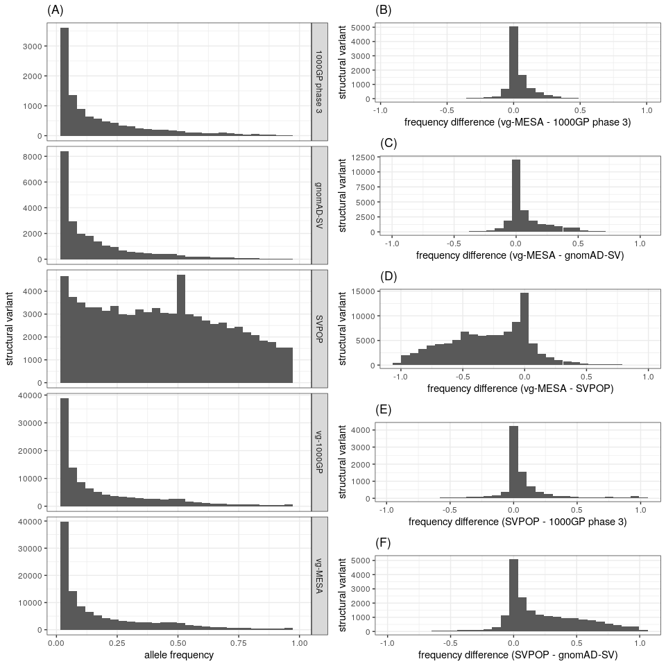<!-- -->

``` r
pdf('figs/fig-sv-freq-comp.pdf', 8, 8)
grid.arrange(grobs=plot_list(ggp, c("afdist", "mesa_kgp3", "mesa_gnomad", "mesa_svpop", "svpop_kgp3", "svpop_gnomad")),
             layout_matrix=matrix(c(rep(1, 5), 2:6), nrow=5))
dev.off()
```

    ## png 
    ##   2

## Save novel SVs

Not present in the 1000GP phase 3 SV catalog or gnomAD-SV

``` r
in.kgp3.gnomad = unique(c(freq.kgp.kgp3.df$queryHits, freq.kgp.gnomad.df$queryHits))
kgp.s[setdiff(1:length(kgp.s), in.kgp3.gnomad)] %>% as.data.frame %>%
  select(svsite) %>%
  write.table(file='svsite.2504kgp.novel.tsv', sep='\t', quote=FALSE, row.names=FALSE)
```
