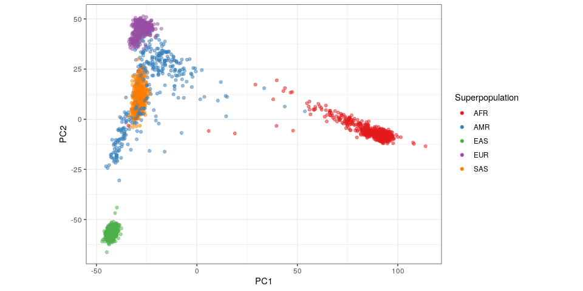
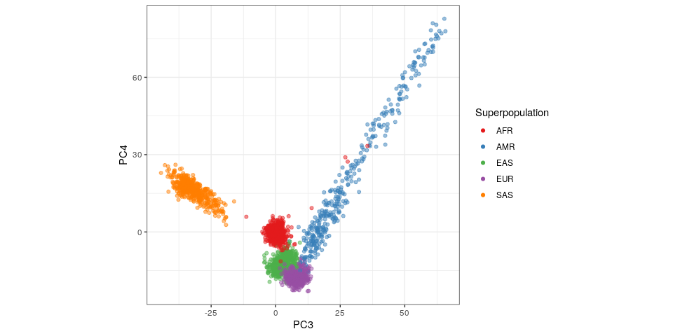
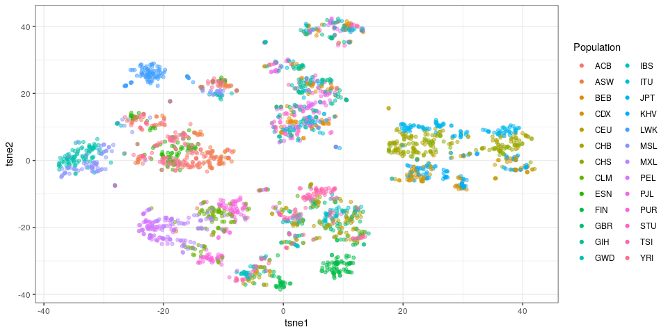
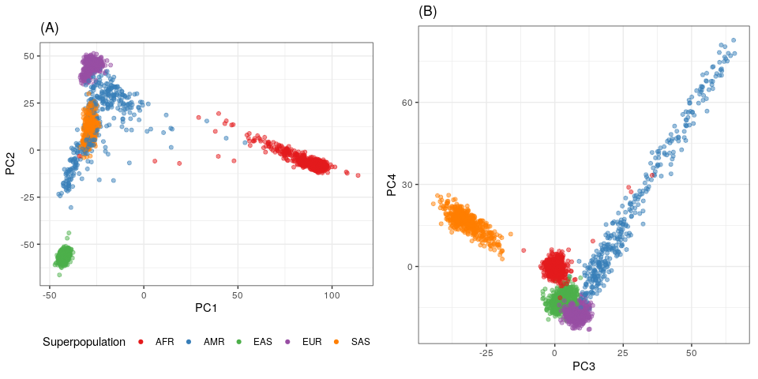

Principal component analysis using SV genotypes in the 1000 Genomes
Project
================

``` r
library(dplyr)
library(ggplot2)
library(gridExtra)
library(Rtsne)
## color palette with clear separation between consecutive groups
interk <- function(x, k=4){ # Interleaves elements in x
  idx = unlist(lapply(1:k, function(kk) seq(kk, length(x), k)))
  x[idx]
}
pal <- function(n){
  pal = interk(rainbow(n, s=.8), 5)
}
## list of figures
ggp = list()
```

## Read PC results

``` r
## PCs derived from SV genotypes
pca.o = readRDS('2504kgp.svsite80al.ac.pcs.rds')
pc.df = tibble(sample=rownames(pca.o$x)) %>% cbind(pca.o$x)
head(pc.df)
```

    ##          sample       PC1      PC2       PC3       PC4         PC5       PC6
    ## NA06985 NA06985 -28.67970 45.82652  5.346095 -17.31069  0.01531248  8.715304
    ## NA07000 NA07000 -27.50498 44.82494  9.940285 -16.93022 -0.82373048 12.835942
    ## NA07037 NA07037 -26.33309 47.99923  9.376427 -18.58537  1.20808270 -4.948668
    ## NA11830 NA11830 -30.31906 45.34968 10.009688 -14.67113 -1.29212580 15.454445
    ## NA11832 NA11832 -27.21150 45.04244  7.426697 -18.48307 -1.61039113 -9.957681
    ## NA11840 NA11840 -31.04773 42.31928  9.300574 -18.50784 -2.15079680 -3.925285
    ##                PC7        PC8        PC9       PC10       PC11       PC12
    ## NA06985 -0.2616044  5.0136874 -9.4252122  0.9854817  -7.303682   4.849319
    ## NA07000 -2.4094016  0.5732477  7.2484685 -0.6262457 -10.794695  -5.318994
    ## NA07037  4.4616801  1.7332681 -0.4028449 -0.1438345  -3.220812   1.899719
    ## NA11830 -2.5530211 -3.0386674 12.4169055 -0.3405033  13.873986 -11.097704
    ## NA11832  4.8753133  4.9456603 -7.5927054  1.9382493  -5.481494   6.824110
    ## NA11840  3.9029562 -0.2502715 -3.7898774 -0.3433447  17.514216   3.246016
    ##                 PC13      PC14        PC15       PC16      PC17      PC18
    ## NA06985 -3.217170567  5.212863  0.08363769 -10.421284  1.440063 -1.419514
    ## NA07000  1.227624601  4.586043  0.26496940  -2.219311 -4.215477 13.095465
    ## NA07037 -8.281553581 -2.125106  0.99011077  -2.119904  2.565330  9.141547
    ## NA11830  1.309863258 -5.081584  1.25480664  -8.183691  9.154143 -7.200298
    ## NA11832 -6.597569572  6.433256 -1.44278405  -9.248817 -4.682698 -2.929562
    ## NA11840 -0.007772477 -6.763462 -6.90094445  -3.207465 11.015881  5.395673
    ##               PC19       PC20
    ## NA06985  0.4150183 -0.6423443
    ## NA07000 -2.5377857 -4.9763250
    ## NA07037 -8.7708557 -2.6321822
    ## NA11830 -2.9499936 -4.4317899
    ## NA11832 -5.9069087 -1.4717110
    ## NA11840 -5.3504095 -1.0274863

## Read sample information from the 1000 Genomes Project

``` r
samps.df = read.table('1kgp-info.tsv', as.is=TRUE, header=TRUE)
colnames(samps.df)[1] = 'sample'
sample_n(samps.df, 3)
```

    ##    sample Population Sex Superpopulation
    ## 1 HG03805        BEB   2             SAS
    ## 2 HG01521        IBS   1             EUR
    ## 3 HG00290        FIN   1             EUR

``` r
samps.df %>% group_by(Superpopulation) %>% summarize(n=n(), .groups='drop')
```

    ## # A tibble: 5 x 2
    ##   Superpopulation     n
    ##   <chr>           <int>
    ## 1 AFR               893
    ## 2 AMR               490
    ## 3 EAS               585
    ## 4 EUR               633
    ## 5 SAS               601

``` r
pc.df = merge(pc.df, samps.df)
```

## PCs from SV genotypes

``` r
tibble(x=1:20, y=pca.o$sdev[1:20]) %>%
  ggplot(aes(x,y)) +
  geom_bar(stat='identity') + 
  theme_bw() +
  ylab('standard deviation') + xlab('principal component')
```

<!-- -->

``` r
ggp$svpc = ggplot(pc.df, aes(x=PC1, y=PC2, color=Superpopulation)) +
  geom_point(alpha=.5) +
  scale_color_brewer(palette='Set1') +
  theme_bw() + coord_fixed() +
  guides(colour=guide_legend(override.aes=list(alpha=1)))
ggp$svpc
```

<!-- -->

``` r
ggp$svpc.3.4 = ggplot(pc.df, aes(x=PC3, y=PC4, color=Superpopulation)) +
  geom_point(alpha=.5) +
  scale_color_brewer(palette='Set1') +
  guides(colour=guide_legend(override.aes=list(alpha=1))) + 
  theme_bw() + coord_fixed()
ggp$svpc.3.4
```

<!-- -->

## tSNE

``` r
tsne.o = Rtsne(pca.o$x[,1:20])

tsne.df = tibble(sample=rownames(pca.o$x), tsne1=tsne.o$Y[,1], tsne2=tsne.o$Y[,2])
tsne.df = merge(tsne.df, samps.df)

ggp$svtsne = ggplot(tsne.df, aes(x=tsne1, y=tsne2, color=Superpopulation)) +
  geom_point(alpha=.7) +
  scale_color_brewer(palette='Set1') +
  guides(colour=guide_legend(override.aes=list(alpha=1))) + 
  theme_bw()
ggp$svtsne
```

<!-- -->

``` r
ggp$svtsne.pop = ggplot(tsne.df, aes(x=tsne1, y=tsne2, color=Population)) +
  geom_point(alpha=.5) +
  guides(colour=guide_legend(override.aes=list(alpha=1))) + 
  theme_bw()
ggp$svtsne.pop
```

<!-- -->

## Multi-panel figure

``` r
## adds a legend title: a), b), etc
plot_list <- function(ggp.l, gg.names=NULL){
  if(is.null(names(ggp.l))) names(ggp.l) = paste0('g', 1:length(ggp.l))
  if(is.null(gg.names)) gg.names = names(ggp.l)
  lapply(1:length(gg.names), function(ii) ggp.l[[gg.names[ii]]] + ggtitle(paste0(LETTERS[ii], ')')))
}

ggp$svpc.3.4.f = ggp$svpc.3.4 + guides(color=FALSE)
ggp$svpc.f = ggp$svpc + theme(legend.position='bottom')
grid.arrange(grobs=plot_list(ggp, c('svpc.f', 'svpc.3.4.f')),
             layout_matrix=matrix(c(1,2),1))
```

<!-- -->

``` r
pdf('figs/fig-sv-1kgp-pcs.pdf', 9, 4)
grid.arrange(grobs=plot_list(ggp, c('svpc.f', 'svpc.3.4.f')),
             layout_matrix=matrix(c(1,2),1))
dev.off()
```

    ## png 
    ##   2
