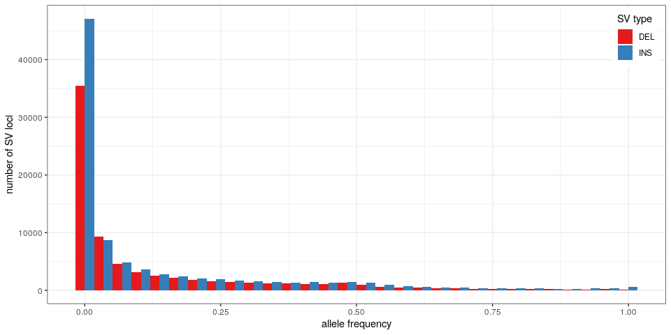
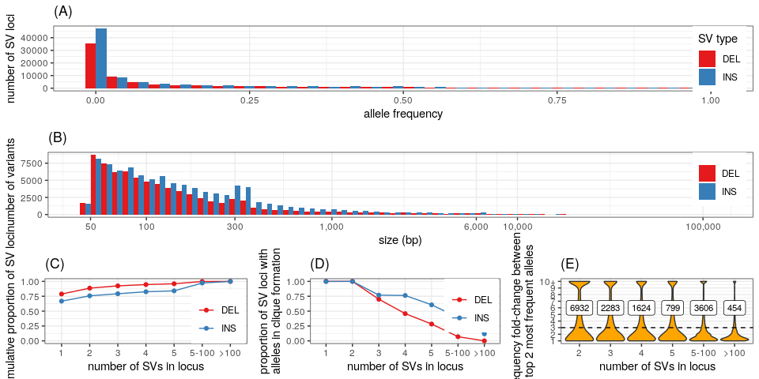

Summary stats for SVs in the 2,504 unrelated samples from the 1000
Genomes Project
================

``` r
library(dplyr)
library(ggplot2)
library(gridExtra)
library(knitr)
library(GenomicRanges)
library(rtracklayer)
winsor <- function(x, u){
  if(any(x>u)) x[x>u] = u
  x
}
## list of graphs
ggp = list()
```

## Read population stats for each SV allele

``` r
## SVs grouped by site ('svsite' and 'clique' columns)
svs = read.table('svs.2504kgp.svsite80al.tsv.gz', as.is=TRUE, header=TRUE)

## stats for each SV locus
## use the most frequent allele (and then the largest) for ac/af/size
## also saves sum/max/min across all alleles
locs = svs %>% arrange(desc(af), desc(size)) %>%
  group_by(seqnames, svsite, type, clique) %>%
  summarize(start=start[1], end=end[1],
            ac.tot=sum(ac), ac=ac[1],
            af.tot=sum(af), af.top2=tail(head(af, 2), 1), af=af[1],
            af.top.fc=ifelse(af.top2==0, 10, af/af.top2),
            loc.n=n(),
            size.min=min(size), size.max=max(size), size=size[1],
            .groups='drop') %>%
  filter(size>=50)

set.seed(123)
sample_n(locs, 10) %>% as.data.frame
```

    ##    seqnames       svsite type clique     start       end ac.tot   ac
    ## 1      chr6 sv_1512131_0  INS   TRUE 170658978 170658978      2    2
    ## 2      chr6 sv_1394394_0  INS   TRUE    520627    520627     12    3
    ## 3      chrX   sv_24793_0  DEL   TRUE   1083823   1083941      4    4
    ## 4      chr3 sv_1819993_0  DEL  FALSE 195780671 195780815    100   54
    ## 5      chr6 sv_1402682_0  INS  FALSE   1205657   1205657     82   51
    ## 6     chr16  sv_562246_0  DEL   TRUE   1373023   1373075      2    2
    ## 7     chr19  sv_272224_0  DEL   TRUE    270120    270189     25   25
    ## 8     chr16  sv_574763_0  DEL   TRUE  22939844  22939945      7    7
    ## 9      chr7 sv_1316948_0  INS   TRUE 148869723 148869723    265  265
    ## 10    chr17  sv_511936_0  INS   TRUE  82672186  82672186   1750 1750
    ##         af.tot     af.top2           af af.top.fc loc.n size.min size.max size
    ## 1  0.000399361 0.000399361 0.0003993610  1.000000     1      305      305  305
    ## 2  0.002396166 0.000399361 0.0005990415  1.500000     8      147      149  147
    ## 3  0.000798722 0.000798722 0.0007987220  1.000000     1      118      118  118
    ## 4  0.019968051 0.006988818 0.0107827476  1.542857     6      143      144  144
    ## 5  0.016373802 0.002196486 0.0101837061  4.636364     9       50       51   51
    ## 6  0.000399361 0.000399361 0.0003993610  1.000000     1       52       52   52
    ## 7  0.004992013 0.004992013 0.0049920128  1.000000     1       69       69   69
    ## 8  0.001397764 0.001397764 0.0013977636  1.000000     1      101      101  101
    ## 9  0.052915335 0.052915335 0.0529153355  1.000000     1      593      593  593
    ## 10 0.349440895 0.349440895 0.3494408946  1.000000     1      553      553  553

## Allele/site numbers

``` r
## numbers by type
rbind(locs %>% mutate(type='all') %>% group_by(type) %>% summarize(alleles=sum(loc.n), sites=n()),
      locs %>% group_by(type) %>% summarize(alleles=sum(loc.n), sites=n())) %>%
  mutate(prop.alleles=alleles/alleles[1], prop.sites=sites/sites[1]) %>% 
  kable(digits=3, format.args=list(big.mark=','))
```

| type |   alleles |   sites | prop.alleles | prop.sites |
| :--- | --------: | ------: | -----------: | ---------: |
| all  | 1,788,216 | 166,199 |        1.000 |      1.000 |
| DEL  |   188,299 |  74,594 |        0.105 |      0.449 |
| INS  | 1,599,917 |  91,605 |        0.895 |      0.551 |

``` r
## numbers of cliques
locs %>% group_by(clique) %>% summarize(sites=n()) %>% ungroup %>% mutate(prop=sites/sum(sites)) %>%
  kable(digits=3, format.args=list(big.mark=','))
```

| clique |   sites |  prop |
| :----- | ------: | ----: |
| FALSE  |  16,788 | 0.101 |
| TRUE   | 149,411 | 0.899 |

``` r
## numbers of cliques by type
locs %>% group_by(type, clique) %>% summarize(sites=n()) %>%
  group_by(type) %>% mutate(prop.type=sites/sum(sites)) %>% 
  kable(digits=3, format.args=list(big.mark=','))
```

| type | clique |  sites | prop.type |
| :--- | :----- | -----: | --------: |
| DEL  | FALSE  |  5,245 |     0.070 |
| DEL  | TRUE   | 69,349 |     0.930 |
| INS  | FALSE  | 11,543 |     0.126 |
| INS  | TRUE   | 80,062 |     0.874 |

## Size

``` r
ggp$size = locs %>% as.data.frame %>%
  ggplot(aes(x=size, fill=type)) +
  geom_histogram(position='dodge', bins=60) +
  scale_fill_brewer(palette='Set1', name='SV type') + 
  theme_bw() +
  xlab('size (bp)') +
  scale_x_log10(breaks=c(0, 50, 100, 300, 1000, 6000, 1e4, 1e5),
                labels=c(0, 50, 100, 300, '1,000', '6,000', '10,000', '100,000')) + 
  ylab('number of variants') +
  theme(legend.title=element_blank()) + 
  ## theme(axis.text.x=element_text(angle=45, hjust=1)) + 
  theme(legend.position=c(.99, .99), legend.justification=c(1,1))
ggp$size
```

<!-- -->

``` r
locs %>% mutate(type='all') %>% rbind(locs) %>%
  group_by(type) %>%
  summarize(min.size=min(size), max.size=max(size),
    size.lt1kbp=mean(size<=1000), size.lt500=mean(size<=500))
```

    ## # A tibble: 3 x 5
    ##   type  min.size max.size size.lt1kbp size.lt500
    ##   <chr>    <int>    <int>       <dbl>      <dbl>
    ## 1 all         50   125187       0.943      0.896
    ## 2 DEL         50   114201       0.944      0.907
    ## 3 INS         50   125187       0.942      0.886

## Overlap with simple repeats, satellites or low-complexity regions

``` r
## simple repeats
if(!file.exists('simpleRepeat.hg38.txt.gz')){
  download.file('https://hgdownload.soe.ucsc.edu/goldenPath/hg38/database/simpleRepeat.txt.gz', 'simpleRepeat.hg38.txt.gz')
}
sr = read.table('simpleRepeat.hg38.txt.gz', as.is=TRUE)
sr = reduce(GRanges(sr$V2, IRanges(sr$V3, sr$V4)))
sr$repClass = 'Simple_repeat'
## repeat masker with low-complexity regions
if(!file.exists('rmsk.txt.gz')){
  download.file('https://hgdownload.soe.ucsc.edu/goldenPath/hg38/database/rmsk.txt.gz', 'rmsk.txt.gz')
}
rm = read.table('rmsk.txt.gz', as.is=TRUE,
                colClasses=c(rep("NULL", 5), 'character', 'integer', 'integer',
                             rep('NULL', 3), 'character',  rep('NULL', 5)))
colnames(rm) = c('chr', 'start', 'end', 'repClass')
rm = subset(rm, repClass %in% c('Low_complexity', 'Simple_repeat', 'Satellite'))
rm = makeGRangesFromDataFrame(rm, keep.extra.columns=TRUE)
rm = c(rm, sr)

locs.gr = makeGRangesFromDataFrame(locs)

olRep <- function(locs.gr, rm.r){
  rm.r = reduce(rm.r)
  findOverlaps(locs.gr, rm.r) %>% as.data.frame %>%
    mutate(sv.w=width(locs.gr[queryHits]), ol.w=width(pintersect(locs.gr[queryHits], rm.r[subjectHits])),
           ol.prop=ol.w/sv.w) %>%
    group_by(queryHits) %>% summarize(ol.prop=sum(ol.prop), .groups='drop')
}

## all: simple repeats, low complexity, satellites
ol.df = olRep(locs.gr, rm)
locs$rep.sr.lc.sat = 0
locs$rep.sr.lc.sat[ol.df$queryHits] = ol.df$ol.prop
## simple repeats + low-complexity
ol.df = olRep(locs.gr, subset(rm, repClass %in% c('Simple_repeat', 'Low_complexity')))
locs$rep.sr.lc = 0
locs$rep.sr.lc[ol.df$queryHits] = ol.df$ol.prop
## simple repeats
ol.df = olRep(locs.gr, subset(rm, repClass=='Simple_repeat'))
locs$rep.sr = 0
locs$rep.sr[ol.df$queryHits] = ol.df$ol.prop
## low complexity
ol.df = olRep(locs.gr, subset(rm, repClass=='Low_complexity'))
locs$rep.lc = 0
locs$rep.lc[ol.df$queryHits] = ol.df$ol.prop
## simple repeats
ol.df = olRep(locs.gr, subset(rm, repClass=='Satellite'))
locs$rep.sat = 0
locs$rep.sat[ol.df$queryHits] = ol.df$ol.prop

locs %>%  mutate(type='all') %>% rbind(locs) %>%
  group_by(type) %>% 
  summarize(rep.sr.lc.sat.50=mean(rep.sr.lc.sat>=.50), rep.sr.lc.50=mean(rep.sr.lc>=.50),
                   rep.sr.50=mean(rep.sr>=.50),
                   rep.lc.50=mean(rep.lc>=.50), rep.sat.50=mean(rep.sat>=.50)) %>%
  kable(digits=3)
```

| type | rep.sr.lc.sat.50 | rep.sr.lc.50 | rep.sr.50 | rep.lc.50 | rep.sat.50 |
| :--- | ---------------: | -----------: | --------: | --------: | ---------: |
| all  |            0.846 |        0.845 |     0.844 |     0.015 |      0.016 |
| DEL  |            0.837 |        0.836 |     0.836 |     0.015 |      0.018 |
| INS  |            0.853 |        0.852 |     0.851 |     0.016 |      0.015 |

*sr*: simple repeat; *lc*: low-complexity; *sat*: satellite DNA. *.50*
means that at least 50% of the SV region overlaps repeats.

### Non-clique SV sites are repeat-rich

We expect most non-clique sites, i.e. with very different alleles, to be
repeat variation like short-tandem repeats variation (or VNTRs). Is it?

``` r
locs %>% mutate(type='all') %>% rbind(locs) %>%
  filter(!clique) %>% 
  group_by(type) %>% 
  summarize(rep.sr.lc.sat.50=mean(rep.sr.lc.sat>=.50), rep.sr.lc.50=mean(rep.sr.lc>=.50),
                   rep.sr.50=mean(rep.sr>=.50),
                   rep.lc.50=mean(rep.lc>=.50), rep.sat.50=mean(rep.sat>=.50)) %>%
  kable(digits=3)
```

| type | rep.sr.lc.sat.50 | rep.sr.lc.50 | rep.sr.50 | rep.lc.50 | rep.sat.50 |
| :--- | ---------------: | -----------: | --------: | --------: | ---------: |
| all  |            0.978 |        0.978 |     0.977 |     0.015 |      0.008 |
| DEL  |            0.986 |        0.986 |     0.986 |     0.008 |      0.008 |
| INS  |            0.974 |        0.974 |     0.973 |     0.018 |      0.008 |

Yes, almost all are within simple repeats. What are the ones that are
not?

``` r
locs.nc = locs %>% filter(!clique, rep.sr.lc.sat<=.5)

## distance to simple repeat
locs.nc.gr = makeGRangesFromDataFrame(locs.nc)
dd = distanceToNearest(locs.nc.gr, rm) %>% as.data.frame
locs.nc$rep.dist = NA
locs.nc$rep.dist[dd$queryHits] = dd$distance

## random subset
set.seed(123)
locs.nc %>%
  filter(size.min/size.max>.8) %>% 
  mutate(coord=paste0('[', seqnames, ':', start, '-', end,
                      '](https://genome.ucsc.edu/cgi-bin/hgTracks?db=hg38&position=',
                      seqnames, '%3A', start, '%2D', end, ')')) %>% 
  select(coord, svsite, type, size, loc.n, size.min, size.max, rep.dist, rep.sr.lc.sat) %>% sample_n(10) %>%
  kable
```

| coord                                                                                                                | svsite         | type | size | loc.n | size.min | size.max | rep.dist | rep.sr.lc.sat |
| :------------------------------------------------------------------------------------------------------------------- | :------------- | :--- | ---: | ----: | -------: | -------: | -------: | ------------: |
| [chr11:108408671-108408671](https://genome.ucsc.edu/cgi-bin/hgTracks?db=hg38&position=chr11%3A108408671%2D108408671) | sv\_935225\_0  | INS  |   92 |     8 |       75 |       93 |        2 |     0.0000000 |
| [chr17:43260332-43260332](https://genome.ucsc.edu/cgi-bin/hgTracks?db=hg38&position=chr17%3A43260332%2D43260332)     | sv\_482825\_0  | INS  |  801 |    16 |      801 |      921 |      761 |     0.0000000 |
| [chr7:43342586-43342586](https://genome.ucsc.edu/cgi-bin/hgTracks?db=hg38&position=chr7%3A43342586%2D43342586)       | sv\_1291357\_0 | INS  |  280 |    19 |      236 |      280 |      860 |     0.0000000 |
| [chr17:43251220-43251572](https://genome.ucsc.edu/cgi-bin/hgTracks?db=hg38&position=chr17%3A43251220%2D43251572)     | sv\_481489\_0  | DEL  |  352 |     5 |      318 |      352 |        0 |     0.4730878 |
| [chrX:135723989-135723989](https://genome.ucsc.edu/cgi-bin/hgTracks?db=hg38&position=chrX%3A135723989%2D135723989)   | sv\_75863\_0   | INS  |  104 |     8 |      103 |      128 |       12 |     0.0000000 |
| [chrX:46497436-46497436](https://genome.ucsc.edu/cgi-bin/hgTracks?db=hg38&position=chrX%3A46497436%2D46497436)       | sv\_46105\_0   | INS  |   56 |    17 |       49 |       56 |     2418 |     0.0000000 |
| [chr14:24043342-24043342](https://genome.ucsc.edu/cgi-bin/hgTracks?db=hg38&position=chr14%3A24043342%2D24043342)     | sv\_674092\_0  | INS  |  317 |    88 |      266 |      324 |      878 |     0.0000000 |
| [chr22:22120840-22120848](https://genome.ucsc.edu/cgi-bin/hgTracks?db=hg38&position=chr22%3A22120840%2D22120848)     | sv\_96341\_0   | INS  |  196 |    50 |      174 |      201 |        7 |     0.0000000 |
| [chr3:23256656-23256656](https://genome.ucsc.edu/cgi-bin/hgTracks?db=hg38&position=chr3%3A23256656%2D23256656)       | sv\_1762710\_0 | INS  |  299 |   131 |      256 |      313 |     1551 |     0.0000000 |
| [chr2:87247911-87247911](https://genome.ucsc.edu/cgi-bin/hgTracks?db=hg38&position=chr2%3A87247911%2D87247911)       | sv\_1887946\_0 | INS  |   52 |    28 |       52 |       52 |     2739 |     0.0000000 |

Either very close to repeats, or in segmental duplication or
transposons, or slightly below the 80% threshold used to define matching
alleles.

## Gene annotation

``` r
if(!file.exists('gencode.v35.annotation.gtf.gz')){
  download.file('ftp://ftp.ebi.ac.uk/pub/databases/gencode/Gencode_human/release_35/gencode.v35.annotation.gtf.gz', 'gencode.v35.annotation.gtf.gz')
}
genc = import('gencode.v35.annotation.gtf.gz')

genc.pc = subset(genc, type %in% c('CDS', 'UTR', 'gene') & gene_type=='protein_coding')
ol.gene = findOverlaps(locs.gr, genc.pc) %>% as.data.frame %>%
  mutate(gene=genc.pc$gene_name[subjectHits], type=genc.pc$type[subjectHits]) %>%
  group_by(queryHits) %>% summarize(cds=any(type=='CDS'), int.utr=any(type!='CDS'))

ol.gene %>% summarize(cds.int.utr=n(), cds=sum(cds)) %>% kable
```

| cds.int.utr |  cds |
| ----------: | ---: |
|       76360 | 1599 |

## Allele frequency

``` r
ggp$af = locs %>% as.data.frame %>%
  ggplot(aes(x=af, fill=type)) +
  geom_histogram(position='dodge') +
  scale_fill_brewer(palette='Set1', name='SV type') + 
  theme_bw() +
  xlab('allele frequency') +
  ylab('number of SV loci') +
  theme(legend.position=c(.99, .99), legend.justification=c(1,1))
ggp$af
```

<!-- -->

``` r
## comparing allele frequency between top 2 most frequent alleles in SV loci
locs.s.3 = locs %>% filter(loc.n>1) %>%
  mutate(loc.n=cut(loc.n, breaks=c(1:5,100,Inf), labels=c(2:5, '5-100', '>100'))) %>% 
  filter(af.top.fc>3) %>% group_by(loc.n) %>% summarize(n=n())
ggp$af.top = locs %>% filter(loc.n>1) %>%
  mutate(loc.n=cut(loc.n, breaks=c(1:5,100,Inf), labels=c(2:5, '5-100', '>100'))) %>% 
  ggplot(aes(x=loc.n, y=winsor(af.top.fc, 10))) +
  geom_violin(scale='width', fill='orange') +
  theme_bw() +
  scale_y_continuous(breaks=1:10, labels=c(1:9, '10+')) +
  ylab('frequency fold-change between\ntop 2 most frequent alleles') +
  xlab('number of SVs in locus') +
  theme(legend.title=element_blank()) + 
  geom_hline(yintercept=3, linetype=2) +
  geom_label(aes(label=n), y=6, data=locs.s.3, size=3)
ggp$af.top
```

<!-- -->

``` r
locs %>% filter(loc.n>1) %>%
  summarize(af.fc.3=sum(af.top.fc>3),
            af01.af2lt01=sum(af>=.01 & af.top2<.01),
            af01.af2lt01.fc3=sum(af>=.01 & af.top2<.01 & af.top.fc>3),
            major.al=sum(af>af.top2)) %>%
  kable
```

| af.fc.3 | af01.af2lt01 | af01.af2lt01.fc3 | major.al |
| ------: | -----------: | ---------------: | -------: |
|   15698 |         7326 |             6032 |    38730 |

  - *af.fc.3*: SV sites where the most frequent allele is at least 3
    times more frequent than the seoncd most frequent allele.
  - *af01.af2lt01*: SV sites where most frequent allele with frequency
    \>1% but other alleles with \<1% frequency.
  - *af01.af2lt01.fc3*: Same + the most frequent allele is at least 3
    times more frequent than the seoncd most frequent allele.
  - *major.al*: SV sites with one allele more frequent than the other
    alleles.

## Alleles per SV sites

``` r
## number of alleles per loci
ggp$loc.al = locs %>% mutate(loc.n=cut(loc.n, breaks=c(0:5,100,Inf), labels=c(1:5, '5-100', '>100'))) %>%
  group_by(loc.n, type) %>% summarize(n=n(), .groups='drop') %>%
  arrange(loc.n) %>% group_by(type) %>% mutate(cprop=cumsum(n)/sum(n)) %>% 
  ggplot(aes(x=loc.n, y=cprop, color=type, group=type)) +
  geom_line() + 
  geom_point() + 
  theme_bw() +
  ylim(0,1) + 
  scale_color_brewer(palette='Set1', name='SV type') + 
  ylab('cumulative proportion of SV loci') +
  xlab('number of SVs in locus') +
  theme(legend.title=element_blank()) + 
  theme(legend.position=c(.99, .01), legend.justification=c(1,0))
ggp$loc.al
```

<!-- -->

``` r
## proportion of cliques, i.e. all alleles similar, in a SV locus
ggp$loc.cl = locs %>% mutate(loc.n=cut(loc.n, breaks=c(0:5,100,Inf), labels=c(1:5, '5-100', '>100'))) %>%
  group_by(loc.n, type) %>% summarize(cl.prop=mean(clique)) %>% 
  ggplot(aes(x=loc.n, y=cl.prop, color=type, group=type)) +
  geom_line() + 
  geom_point() + 
  theme_bw() +
  ylim(0,1) + 
  scale_color_brewer(palette='Set1', name='SV type') + 
  ylab('proportion of SV loci with\nalleles in clique formation') +
  xlab('number of SVs in locus') +
  theme(legend.title=element_blank()) + 
  theme(legend.position=c(.99, .99), legend.justification=c(1,1))
ggp$loc.cl
```

<!-- -->

## Multi-panel figure

``` r
## adds a legend title: a), b), etc
plot_list <- function(ggp.l, gg.names=NULL){
  if(is.null(names(ggp.l))) names(ggp.l) = paste0('g', 1:length(ggp.l))
  if(is.null(gg.names)) gg.names = names(ggp.l)
  lapply(1:length(gg.names), function(ii) ggp.l[[gg.names[ii]]] + ggtitle(paste0('(', LETTERS[ii], ')')))
}

grid.arrange(grobs=plot_list(ggp, c("af", "size", "loc.al", "loc.cl", "af.top")),
             layout_matrix=matrix(c(1,1,1,2,2,2,3,4,5), nrow=3, byrow=TRUE))
```

<!-- -->

``` r
pdf('figs/fig-sv-1kgp-stats.pdf', 10, 8)
grid.arrange(grobs=plot_list(ggp, c("af", "size", "loc.al", "loc.cl", "af.top")),
             layout_matrix=matrix(c(1,1,1,2,2,2,3,4,5), nrow=3, byrow=TRUE))
dev.off()
```

    ## png 
    ##   2

## Save TSV with SV site information

``` r
outf = gzfile('locs.2504kgp.svsite80al.tsv.gz', 'w')
write.table(locs, file=outf, row.names=FALSE, quote=FALSE, sep='\t')
close(outf)
```
