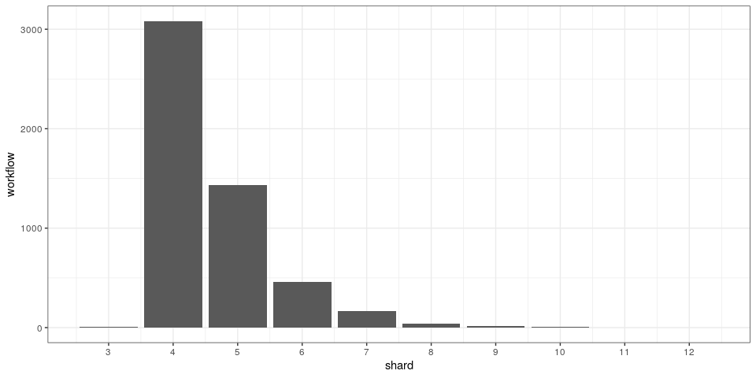
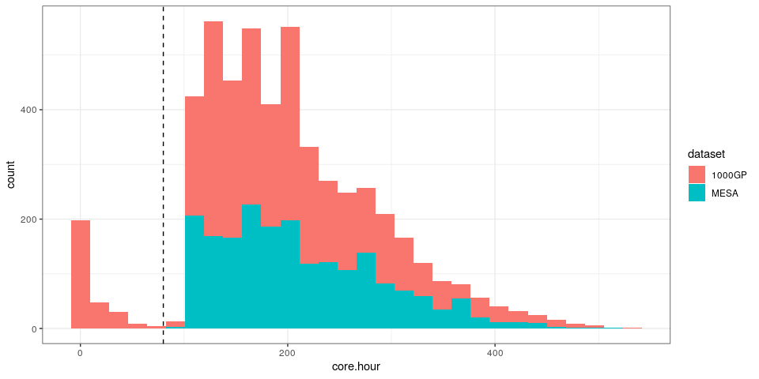
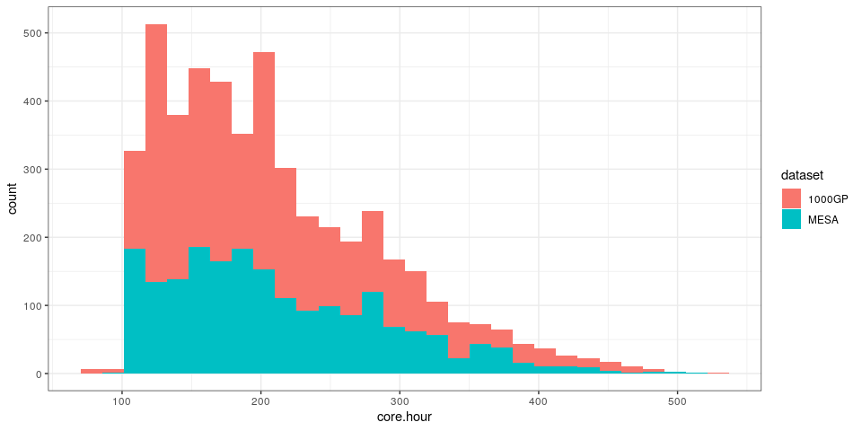

Summary of the resources used for SV genotyping
================

Extracted from Terra using
[terra-notebook-utils](https://github.com/DataBiosphere/terra-notebook-utils).
At the time of running this, the module for cost estimation is still
experimental. Information from some of the jobs might be missing, for
example if it needed re-running or was too old. There was also an issue
on Terra while we were genotyping the 1000GP dataset that might have
affected the reporting of these metrics. Still, the vast majority of the
submissions will have complete information that we can use to estimate
the average resource requirement.

``` r
library(dplyr)
library(ggplot2)
library(knitr)
```

## Read resource metrics for both MESA and 1000GP analysis

``` r
res.df = rbind(
  read.table('./terra-mesa-subs-resources.tsv.gz', header=TRUE, as.is=TRUE) %>% mutate(dataset='MESA'),
  read.table('./terra-1kgp-subs-resources.tsv.gz', header=TRUE, as.is=TRUE) %>% mutate(dataset='1000GP')
)
res.df = res.df %>% mutate(core.hour=cpu*duration/3600)
sample_n(res.df, 5)
```

    ##         batch                             workflow shard cpu mem duration
    ## 1 batch_3_500 ba110796-1562-4f4f-8e73-de2006587ac9     1  32 100 4895.882
    ## 2 batch_5_372 f41b59be-4800-4751-aa5a-606856f28c53     4   8  50 3464.571
    ## 3 batch_3_435 b6ec166a-e915-4c45-8e87-3396f82fd066     4   8  50 3786.641
    ## 4 batch_3_500 d36b8795-dbb6-4f51-8ce3-9a75ffac6f64     3  16 100 7805.548
    ## 5 batch_7_599 0a6d36f8-3eaa-4632-bc59-d9ca7beb9479     1  32 100 4385.811
    ##        cost dataset core.hour
    ## 1 0.4316096    MESA 43.518951
    ## 2 0.0989835  1000GP  7.699047
    ## 3 0.1081820  1000GP  8.414758
    ## 4 0.4459828    MESA 34.691324
    ## 5 0.3866503  1000GP 38.984987

## Aggregate per workflow

``` r
res.a = res.df %>% group_by(workflow, dataset) %>%
  summarize(shard=n(), cost=sum(cost), core.hour=sum(core.hour), .groups='drop') %>%
  mutate(preempted=shard-4)
```

## Pre-empted jobs

We used pre-emptible instances for all the steps in the pipeline. If no
jobs were pre-empted, each workflow should contain 4 jobs/shards (CRAM
conversion, mapping two chunks in parallel, SV genotyping). More shards
mean that some were pre-empted. Note: less shards most likely mean that
it was a rerun where cached intermediate results allowed to skip jobs.

``` r
res.a %>% group_by(shard) %>% summarize(workflow=n()) %>%
  ggplot(aes(x=shard, y=workflow)) + geom_bar(stat='identity') + theme_bw() +
  scale_x_continuous(breaks=1:100)
```

<!-- -->

``` r
res.a %>% summarize(mean.preempted.job=mean(preempted), prop.notpreempted=mean(preempted==0)) %>%
  kable(digits=3)
```

| mean.preempted.job | prop.notpreempted |
| -----------------: | ----------------: |
|              0.599 |             0.592 |

## Cost and number of core.hours per sample

``` r
ggplot(res.a, aes(x=core.hour, fill=factor(shard))) + geom_histogram() + theme_bw() +
  geom_vline(xintercept=80, linetype=2)
```

<!-- -->

``` r
ggplot(res.a, aes(x=core.hour, fill=dataset)) + geom_histogram() + theme_bw() +
  geom_vline(xintercept=80, linetype=2)
```

<!-- -->

The jobs below *x=100* are likely under-reported because of the issue
Terra experienced when we were genotyping the 1000GP dataset. The logs
look normal but and the duration on Terra is 0 for all or some of the
steps in the workflow, leading to these under-estimated resources.

Filtering incomplete or problematic jobs:

``` r
res.a %>% filter(core.hour>80, shard>=4) %>% 
  ggplot(aes(x=core.hour, fill=dataset)) + geom_histogram() + theme_bw()
```

<!-- -->

``` r
res.a %>% filter(core.hour>80, shard>=4) %>% 
  ggplot(aes(x=preempted, y=core.hour, group=paste(dataset, preempted), fill=dataset)) +
  geom_boxplot() + theme_bw() +
  scale_x_continuous(breaks=0:100)
```

<!-- -->

``` r
res.a %>% filter(core.hour>80, preempted>=0) %>%
  summarize(mean.preempted.job=mean(preempted), prop.notpreempted=mean(preempted==0)) %>%
  kable(digits=3)
```

| mean.preempted.job | prop.notpreempted |
| -----------------: | ----------------: |
|              0.599 |             0.592 |

``` r
res.a %>% filter(core.hour>80, shard>=4) %>% select(-workflow) %>%
  group_by(preempted, dataset) %>% summarize_all(mean) %>%
  kable(digits=3)
```

| preempted | dataset | shard |  cost | core.hour |
| --------: | :------ | ----: | ----: | --------: |
|         0 | 1000GP  |     4 | 2.017 |   191.791 |
|         0 | MESA    |     4 | 2.082 |   197.981 |
|         1 | 1000GP  |     5 | 2.295 |   218.718 |
|         1 | MESA    |     5 | 2.346 |   222.205 |
|         2 | 1000GP  |     6 | 2.485 |   236.318 |
|         2 | MESA    |     6 | 2.638 |   248.246 |
|         3 | 1000GP  |     7 | 2.636 |   250.244 |
|         3 | MESA    |     7 | 3.019 |   283.251 |
|         4 | 1000GP  |     8 | 3.062 |   291.701 |
|         4 | MESA    |     8 | 2.986 |   277.209 |
|         5 | 1000GP  |     9 | 3.500 |   336.177 |
|         5 | MESA    |     9 | 3.088 |   282.514 |
|         6 | 1000GP  |    10 | 2.577 |   246.442 |
|         6 | MESA    |    10 | 3.105 |   280.710 |
|         8 | 1000GP  |    12 | 4.389 |   410.061 |

As expected, when a job is pre-empted, the total cost and core.hours for
this sample tend to be higher.

## Resources per task

The SV genotyping pipeline has three steps: converting the CRAM file to
FASTQ (and chunking), mapping each chunk, genotyping SVs from the
aligned reads.

``` r
## task name is not extracted yet but we know the resource requested for each of the three tasks
## -> check that there are only 3 requested resource profiles
res.df %>% select(cpu, mem) %>% unique %>% kable
```

|   | cpu | mem |
| - | --: | --: |
| 1 |  32 | 100 |
| 5 |  16 | 100 |
| 8 |   8 |  50 |

``` r
res.df %>% mutate(task=ifelse(cpu==32, 'mapping', 'CRAM conversion'),
                  task=ifelse(cpu==16, 'genotyping', task),
                  task=factor(task, levels=c('CRAM conversion', 'mapping', 'genotyping'))) %>%
  group_by(workflow) %>%
  mutate(preempted=n()-4) %>%
  filter(preempted==0) %>%
  group_by(workflow, task, dataset) %>%
  summarize(cost=sum(cost), core.hour=sum(core.hour), .groups='drop') %>%
  group_by(workflow) %>%
  mutate(prop.cost=cost/sum(cost), prop.core.hour=core.hour/sum(core.hour)) %>% 
  ungroup() %>% 
  select(-workflow) %>% 
  group_by(task, dataset) %>%
  summarize_all(mean) %>%
  kable(digits=3)
```

| task            | dataset |  cost | core.hour | prop.cost | prop.core.hour |
| :-------------- | :------ | ----: | --------: | --------: | -------------: |
| CRAM conversion | 1000GP  | 0.163 |    12.636 |     0.093 |          0.076 |
| CRAM conversion | MESA    | 0.170 |    13.220 |     0.090 |          0.076 |
| mapping         | 1000GP  | 1.377 |   138.782 |     0.700 |          0.739 |
| mapping         | MESA    | 1.564 |   157.660 |     0.725 |          0.771 |
| genotyping      | 1000GP  | 0.301 |    23.433 |     0.207 |          0.185 |
| genotyping      | MESA    | 0.349 |    27.112 |     0.185 |          0.154 |

## Save some tables in LaTeX format

``` r
## cost/core.hour per sample
res.a %>% filter(core.hour>80, shard>=4) %>% select(-workflow) %>%
  group_by(preempted, dataset) %>% summarize_all(mean) %>%
  kable(digits=3, format='latex', caption='resource per sample') %>%
  cat(file='resource-stats.tex')

cat('\n\n', file='resource-stats.tex', append=TRUE)

## resource per task
res.df %>% mutate(task=ifelse(cpu==32, 'mapping', 'CRAM conversion'),
                  task=ifelse(cpu==16, 'genotyping', task),
                  task=factor(task, levels=c('CRAM conversion', 'mapping', 'genotyping'))) %>%
  group_by(workflow) %>%
  mutate(preempted=n()-4) %>%
  filter(preempted==0) %>%
  group_by(workflow, task, dataset) %>%
  summarize(cost=sum(cost), core.hour=sum(core.hour), .groups='drop') %>%
  group_by(workflow) %>%
  mutate(prop.cost=cost/sum(cost), prop.core.hour=core.hour/sum(core.hour)) %>% 
  ungroup() %>% 
  select(-workflow) %>% 
  group_by(task, dataset) %>%
  summarize_all(mean) %>%
  kable(digits=3, format='latex', caption='resource per task') %>%
  cat(file='resource-stats.tex', append=TRUE)
```
